<!-- badges: start -->
[](https://github.com/ejade42/ggDNAvis/actions/workflows/R-CMD-check.yaml)
<!-- badges: end -->

# ggDNAvis

ggDNAvis is an R package that uses ggplot2 to visualise genetic data of three main types:

(1) a single DNA/RNA sequence split across multiple lines,

(2) multiple DNA/RNA sequences, each occupying a whole line, or

(3) base modifications such as DNA methylation called by modified-bases models in Dorado or Guppy.

This is accomplished through main functions `visualise_single_sequence()`, `visualise_many_sequences()`, and `visualise_methylation()` respectively. Each of these has helper sequences for streamlined data processing, as detailed later in the section for each visualisation type.

Additionally, ggDNAvis contains a built-in example dataset (`example_many_sequences`) and a set of colour palettes for DNA visualisation (`sequence_colour_palettes`).

Note that all spellings are the British English version (e.g. "colour", "visualise"). Aliases have not been defined, meaning American spellings will not work.

ggDNAvis is currently available from this github page. Once CRAN submission is accepted, it will be available from CRAN:

```{r, eval = FALSE}
## Currently
devtools::install_github("ejade42/ggDNAvis")

## Soon
install.packages("ggDNAvis")
```

Throughout this manual, only `ggDNAvis`, `dplyr`, and `ggplot2` are loaded.

```{r, message = FALSE}
## Load this package
library(ggDNAvis)

## Load useful tidyverse packages
## These are ggDNAvis dependencies, so will always be installed when installing ggDNAvis
library(dplyr)
library(ggplot2)

## Function for viewing tables throughout this document
github_table <- function(data) {
    quoted <- as.data.frame(
        lapply(data, function(x) {paste0("`", x, "`")}),
        check.names = FALSE
    )
    kable_output <- knitr::kable(quoted)
    return(kable_output)
}
```

# Summary/quickstart
This section contains one example for each type of visualisation. See the relevant full sections for more details and customisation options.

## Single sequence
```{r}
## Create input sequence. This can be any DNA/RNA string
sequence <- paste(c(rep("GGC", 72), rep("GGAGGAGGCGGC", 15)), collapse = "")

## Create visualisation
## This lists out all arguments
## Usually it's fine to leave most of these as defaults
visualise_single_sequence(
    sequence = sequence,
    sequence_colours = sequence_colour_palettes$bright_pale,
    background_colour = "white",
    line_wrapping = 60,
    spacing = 1,
    margin = 0.5,
    sequence_text_colour = "black",
    sequence_text_size = 16,
    index_annotation_colour = "darkred",
    index_annotation_size = 12.5,
    index_annotation_interval = 15,
    index_annotations_above = TRUE,
    index_annotation_vertical_position = 1/3,
    outline_colour = "black",
    outline_linewidth = 3,
    outline_join = "mitre",
    return = FALSE,
    filename = "README_files/output/summary_single_sequence.png",
    render_device = ragg::agg_png,
    pixels_per_base = 100
)

## View image
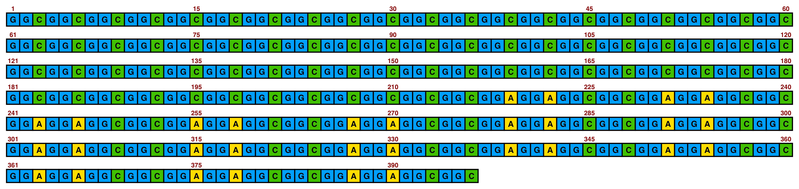
```

## Many sequences
```{r}
## Read and merge data
fastq_data <- read_fastq("inst/extdata/example_many_sequences_raw.fastq", calculate_length = TRUE)
metadata   <- read.csv("inst/extdata/example_many_sequences_metadata.csv")
merged_fastq_data <- merge_fastq_with_metadata(fastq_data, metadata)

## Extract character vector
## These arguments should all be considered, as they are highly specific to your data
sequences_for_visualisation <- extract_and_sort_sequences(
    sequence_dataframe = merged_fastq_data,
    sequence_variable = "forward_sequence",
    grouping_levels = c("family" = 8, "individual" = 2),
    sort_by = "sequence_length",
    desc_sort = TRUE
)

## Create visualisation
## Usually it's fine to leave most of these as defaults
visualise_many_sequences(
    sequences_vector = sequences_for_visualisation,
    sequence_colours = sequence_colour_palettes$ggplot_style,
    background_colour = "white",
    margin = 0.5,
    sequence_text_colour = "black",
    sequence_text_size = 16,
    outline_colour = "black",
    outline_linewidth = 3,
    outline_join = "mitre",
    return = FALSE,
    filename = "README_files/output/summary_many_sequences.png",
    render_device = ragg::agg_png,
    pixels_per_base = 100
)

## View image
knitr::include_graphics("README_files/output/summary_many_sequences.png")
```

## Methylation/modification
```{r}
## Read and merge data
modification_data <- read_modified_fastq("inst/extdata/example_many_sequences_raw_modified.fastq")
metadata          <- read.csv("inst/extdata/example_many_sequences_metadata.csv")
merged_modification_data <- merge_methylation_with_metadata(modification_data, metadata,
                                                            reversed_location_offset = 1)

## Extract list of character vectors
## These arguments should all be considered, as they are highly specific to your data
methylation_for_visualisation <- extract_methylation_from_dataframe(
    modification_data = merged_modification_data,
    locations_colname = "forward_C+m?_locations",
    probabilities_colname = "forward_C+m?_probabilities",
    lengths_colname = "sequence_length",
    grouping_levels = c("family" = 8, "individual" = 2),
    sort_by = "sequence_length",
    desc_sort = TRUE
)

## Create visualisation
## Usually it's fine to leave most of these as defaults
visualise_methylation(
    modification_locations     = methylation_for_visualisation$locations,
    modification_probabilities = methylation_for_visualisation$probabilities,
    sequence_lengths           = methylation_for_visualisation$lengths,
    background_colour = "white",
    other_bases_colour = "grey",
    low_colour = "blue",
    high_colour = "red",
    low_clamp = 0.1*255,
    high_clamp = 0.9*255,
    outline_colour = "black",
    outline_linewidth = 3,
    outline_join = "mitre",
    modified_bases_outline_colour = NA,
    modified_bases_outline_linewidth = NA,
    modified_bases_outline_join = NA,
    other_bases_outline_colour = NA,
    other_bases_outline_linewidth = NA,
    other_bases_outline_join = NA,
    margin = 0.5,
    return = FALSE,
    filename = "README_files/output/summary_methylation.png",
    render_device = ragg::agg_png,
    pixels_per_base = 20
)

## View image
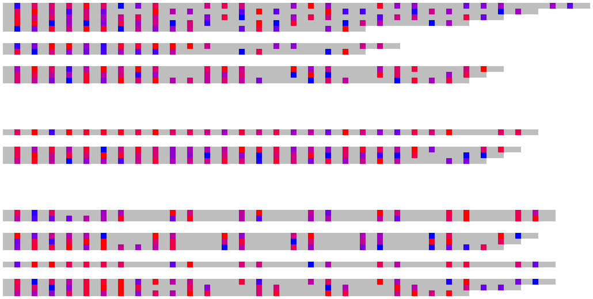

## Create scalebar and save to ggplot object
## Usually it's fine to leave most of these as defaults
scalebar <- visualise_methylation_colour_scale(
    low_colour = "blue",
    high_colour = "red",
    low_clamp = 0.1*255,
    high_clamp = 0.9*255,
    full_range = c(0, 255),
    precision = 10^3,
    background_colour = "white",
    x_axis_title = "Methylation probability",
    do_x_ticks = TRUE,
    do_side_scale = FALSE,
    side_scale_title = NULL,
    outline_colour = "black",
    outline_linewidth = 1
)

## Write png from object (the object is just a standard ggplot)
ggsave("README_files/output/summary_methylation_scalebar.png", scalebar, dpi = 300, width = 5, height = 1.25, device = ragg::agg_png)

## Image viewed in separate HTML after to allow partial width
```

<div align="center">
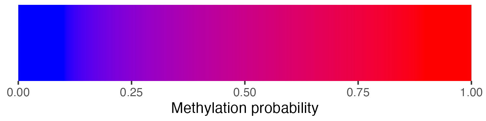
</div>


# Loading data

## Introduction to `example_many_sequences`
ggDNAvis comes with example dataset `example_many_sequences`. In this data, each row/observation represents one read. Reads are associated with metadata such as the participant and family to which they belong, and with sequence data such as the DNA sequence, FASTQ quality scores, and modification information retrieved from the MM and ML tags in a SAM/BAM file.

```{r}
## View the first 4 rows of example_many_sequences data
github_table(head(example_many_sequences, 4))
```

The DNA sequence in column `sequence` is the information used for visualising single/multiple sequences. For visualising DNA modification, this data contains information on both 5-cytosine-methylation and 5-cytosine-hydroxymethylation. For a given modification type (e.g. methylation), visualisation requires a column of locations and a column of probabilities. In this dataset, the relevant columns are `methylation_locations` and `methylation_probabilities` for methylation and `hydroxymethylation_locations` and `hydroxymethylation_probabilities` for hydroxymethylation.

Locations are stored as a comma-condensed string of integers for each read, produced via `vector_to_string()`, and indicate the indices along the read at which the probability of modification was assessed. For example, methylation might be assessed at each CpG site, which in the read `"GGCGGCGGAGGCGGCGGA"` would be the third, sixth, twelfth, and fifteenth bases, thus the location string would be `"3,6,12,15"` for that read.

Probabilities are also a comma-condensed string of integers produced via `vector_to_string()`, but here each integer represents the probability that the corresponding base is modified. Probabilities are stored as 8-bit integers (0-255) where a score of $N$ represents the probability space from $\frac{N}{256}$ to $\frac{N+1}{256}$. For the read above, a probability string of `"250,3,50,127"` would indicate that the third base is almost certainly methylated (97.66%-98.05%), the sixth base is almost certainly not methylated (1.17%-1.56%), the twelfth base is most likely not methylated (19.53%-19.92%), and the fifteenth base may or may not be methylated (49.61%-50.00%)

```{r}
## Function to convert integer scores to corresponding percentages
convert_8bit_to_decimal_prob <- function(x) {
    return(c(  x   / 256, 
             (x+1) / 256))
}

## Convert comma-condensed string back to numerical vector
## string_to_vector() and vector_to_string() are crucial ggDNAvis helpers
probabilities <- string_to_vector("250,3,50,127")

## For each probability, print 8-bit score then percentage range
for (probability in probabilities) {
    percentages <- round(convert_8bit_to_decimal_prob(probability), 4) * 100
    cat("8-bit probability: ", probability, "\n", sep = "")
    cat("Decimal probability: ", percentages[1], "% - ", percentages[2], "%", "\n\n", sep = "")
}
```

## Introduction to `string_to_vector()` and `vector_to_string()`

Lots of the data used in ggDNAvis requires a series of multiple values to be stored within a single observation in a dataframe. The solution used here is condensing vectors to a single string (character value) for simple storage, then reconstituting the original vectors when needed. These functions are basic wrappers around `strsplit()` and `paste(, collapse = ",")` but are easy to use and readable.

Additionally, these can be used when reading SAM/BAM MM and ML tags, which are stored as comma-separated lists within modified FASTQ files, so can also be processed using these functions.

```{r}
vector_to_string(c(1, 2, 3, 4))
string_to_vector("1,2,3,4") # the default vector type is numeric

vector_to_string(c("these", "are", "some", "words"))
string_to_vector("these,are,some,words", type = "character")

vector_to_string(c(TRUE, FALSE, TRUE))
string_to_vector("TRUE,FALSE,TRUE", type = "logical")
```

If multiple strings (i.e. a character vector) are input to `string_to_vector()`, it will concatenate them and produce a single output vector. This is intended, useful behaviour to help with some of the visualisation code in this package. If a list of separate vectors for each input value is desired, `lapply()` can be used.

```{r}
string_to_vector(c("1,2,3", "4,5,6"))
lapply(c("1,2,3", "4,5,6"), string_to_vector)
```


## Loading from FASTQ and metadata file

### Standard FASTQ

To read in a normal FASTQ file (containing a read ID/header, sequence, and quality scores for each read), the function `read_fastq()` can be used. The example data file for this is `inst/extdata/example_many_sequences_raw.fastq`

```{r}
## Look at first 16 lines of FASTQ
fastq_raw <- readLines("inst/extdata/example_many_sequences_raw.fastq")
for (i in 1:16) {
    cat(fastq_raw[i], "\n")
}

## Load data from FASTQ
fastq_data <- read_fastq("inst/extdata/example_many_sequences_raw.fastq", calculate_length = TRUE)

## View first 4 rows
github_table(head(fastq_data, 4))
```
Using the basic `read_fastq()` function returns a dataframe with read ID, sequence, and quality columns. Optionally, a `sequence_length` column can be generated by setting `calculate_length = TRUE`. However, we can see that some of the sequences (e.g. F1-1c) are reversed. This occurs when the read is of the - strand at the biochemical level. 

To convert reverse reads to their forward equivalents, and incorporate additional data such as the participant and family to which each read belongs, we will make use of a metadata file located at `inst/extdata/example_many_sequences_metadata.csv`

```{r}
## Load metadata from CSV
metadata <- read.csv("inst/extdata/example_many_sequences_metadata.csv")

## View first 4 rows
github_table(head(metadata, 4))
```

We see that this metadata file contains the same `read` column with the same unique read IDs and a `direction` column specifying whether each read is `"forward"` or `"reverse"`. These two columns are mandatory. Additionally, we have family and participant ID columns providing additional information on each read.

Note: the `direction` column can be produced manually. However, for large data volumes it may be more effective to use SAMtools to write TXT files of all forward and reverse read IDs via the -F/-f 16 flags, e.g.:

```{bash, eval = FALSE}
## bash/shell code for using SAMtools on the command line:

## See the samtools flag documentation for more details on why
## -F 16 selects forward reads and -F 16 selects reverse reads
samtools view -F 16 ${input_bam_file} | \
awk '{print $1}'  > "forward_reads.txt"

samtools view -f 16 ${input_bam_file} | \
awk '{print $1}'  > "reverse_reads.txt"
```

Then simply read the lines from each file and use that to assign directions:

```{r, eval = FALSE}
## Use files from last step to construct vectors of forward and reverse IDs
forward_reads <- readLines("forward_reads.txt")
reverse_reads <- readLines("reverse_reads.txt")

## Use rep() to add a direction column
constructed_metadata <- data.frame(
    read = c(forward_reads, reverse_reads),
    direction = c(rep("forward", length(forward_reads)),
                  rep("reverse", length(reverse_reads)))
    )
```

In any case, once we have metadata with the `read` and `direction` columns, we can use `merge_fastq_with_metadata()` to combine the metadata and the fastq data. Crucially, this function uses the `direction` column of the metadata to determine which reads are reverse, and reverse-complements these reverse reads only to produce a new column containing the forward version of all reads:

```{r}
## Merge fastq data with metadata
## This function reverse-complements reverse reads to get all forward versions
merged_fastq_data <- merge_fastq_with_metadata(fastq_data, metadata)

## View first 4 rows
github_table(head(merged_fastq_data, 4))
```

Now we have a `forward_sequence` column (scroll to the right if you can't see it!). We can now reformat this data to be exactly the same as the included `example_many_sequences` data:

```{r}
## Subset to only the columns present in example_many_sequences
merged_fastq_data <- merged_fastq_data[, c("family", "individual", "read", "forward_sequence", "sequence_length", "forward_quality")]

## Rename "forward_sequence" to "sequence" and same for quality
colnames(merged_fastq_data)[c(4,6)] <- c("sequence", "quality")

## View first 4 rows of data produced from files
github_table(head(merged_fastq_data, 4))

## View first 4 rows of example_many_sequences (with modification columns excluded)
github_table(head(example_many_sequences[, 1:6], 4))

## Check if equal
identical(merged_fastq_data, example_many_sequences[, 1:6])
```

So, from just a standard FASTQ file and a simple metadata CSV we have successfully reproduced the example_many_sequences data (excluding methylation/modification information) via `read_fastq()` and `merge_fastq_with_metadata()`. We can also write from this dataframe to FASTQ using `write_fastq()`:

```{r}
## Use write_fastq with filename = NA and return = TRUE to create the FASTQ, 
## but return it as a character vector rather than writing to file.
output_fastq <- write_fastq(merged_fastq_data, 
                            filename = NA, return = TRUE,
                            read_id_colname = "read", 
                            sequence_colname = "sequence",
                            quality_colname = "quality")
## View first 16 lines
for (i in 1:16) {
    cat(output_fastq[i], "\n")
}
```

Note that this is not quite identical to the original. That's because we wrote from the forward-sequence and forward-quality columns (after renaming), so the new FASTQ contains all forward versions. If we wanted the original FASTQ we would just provide colnames for the original sequence and quality rather than the forward versions.

Do be careful that either both sequence and quality are the forward versions or neither are. If they are mismatched then the new FASTQ will be wrong.

### Modified FASTQ (eg methylation)

FASTQ files can be extended to include DNA modification (most often 5-cytosine-methylation) information within the header rows. Most often, this information comes from Nanopore long-read sequencing being basecalled with a modification-capable model in Guppy or Dorado, resulting in SAM or BAM files. In SAM/BAM files, modification information is stored in the MM and ML tags. These can be copied to the header rows of a FASTQ file via:

```{bash, eval = FALSE}
samtools fastq -T MM,ML ${input_bam_file} > "modified_fastq_file.fastq"
```

ggDNAvis then contains tools for reading from, processing, and writing to these modified FASTQ files. The example data file for this is `inst/extdata/example_many_sequences_raw_modified.fastq`

```{r}
## Look at first 16 lines of FASTQ
modified_fastq_raw <- readLines("inst/extdata/example_many_sequences_raw_modified.fastq")
for (i in 1:16) {
    cat(modified_fastq_raw[i], "\n")
}
```

This file is identical to the standard FASTQ seen in the [reading standard FASTQ](#331-standard-fastq) section in the sequence and quality lines, but has the MM and ML tags stored in the header. See the [SAM tags specification](https://samtools.github.io/hts-specs/SAMtags.pdf) or the documentation for `read_modified_fastq()`, `merge_methylation_with_metadata()`, and `reverse_locations_if_needed()` for a comprehensive explanation of how these store methylation/modification information.

The modification information stored in these FASTQ header lines can be parsed with `read_modified_fastq()`. This converts the locations from the SAM/BAM MM format to simply being the indices along the read at which modification was assessed (starting indexing at 1). For example, in F1-1a, the `C+m?` (methylation) locations start `"3,6,9,12"`, indicating that the third, sixth, ninth, and twelfth bases in the read were assessed for probability of methylation. Checking the sequence, we see that all of these are CpG sites (CG dinucleotides), which are the main DNA methylation sites in the genome. For each assessed site, the modification probability is given as an 8-bit integer (0-255), where 0 represents ~0% modification probability and 255 represents ~100% modification probability (this is fully explained in \@ref(introduction-to-example_many_sequences)).

```{r}
## Load data from FASTQ
methylation_data <- read_modified_fastq("inst/extdata/example_many_sequences_raw_modified.fastq")

## View first 4 rows
github_table(head(methylation_data, 4))
```

Ultimately, `read_modified_fastq()` outputs a dataframe with the standard read information (ID, sequence, length, quality), a column stating which modification types were assessed for each read (e.g. `"C+h?"` for hydroxymethylation or `"C+m?"` for methylation - refer to the [SAM tags specification](https://samtools.github.io/hts-specs/SAMtags.pdf)), and for each modification type, a column of assessed locations (indices along the read) and a column of modification probabilities (as 8-bit integers).

Modification types, locations, and probabilities are all stored as comma-condensed strings produced from vectors via `vector_to_string()`. These can be converted back to vectors via `string_to_vector()` - see \@ref(introduction-to-string_to_vector-and-vector_to_string).

As with the standard FASTQ, some of the reads in the modified FASTQ are reverse. However, as the assessed modification locations are indices along the read and the probabilities correspond to locations in sequence, the modification information needs to be reversed in addition to reverse complementing the DNA sequence. Analogous to before, this is achieved via the `merge_methylation_with_metadata()` function.

```{r}
## Load metadata from CSV
metadata <- read.csv("inst/extdata/example_many_sequences_metadata.csv")

## View first 4 rows
github_table(head(metadata, 4))
```

The metadata is identical to its previous use in the [reading from standard FASTQ](#331-standard-fastq) section.

```{r}
## Merge fastq data with metadata
## This function reverse-complements reverse reads to get all forward versions
## And correctly flips location and probability information
## See ?merged_methylation_data and ?reverse_locations_if_needed for details
merged_methylation_data <- merge_methylation_with_metadata(methylation_data, metadata)

## View first 4 rows
github_table(head(merged_methylation_data, 4))
```

The merged methylation data contains `forward_` rows for sequence and quality, as before, but also for hydroxymethylation and methylation locations and probabilities. However, looking at the modification locations columns (scroll right on the table), we can see that the indices assessed for modification are 4, 7, 10 etc for sequence `"GGCGGCGGCGGC..."`. This is because the actual biochemical modification was on the Cs on the reverse strand, corresponding to Gs on the forward strand according to Watson-Crick base pairing. For many purposes, it may be desirable to keep these positions to indicate that in reality, the modification occurred at exactly that location on the other strand. This is accomplished by setting `offset = 0` (the default) inside `merge_methylation_with_metadata()`.

However, there is also the option to offset the modification locations by 1. For symmetrical modification sites such as CGs, this means that when the C on the reverse strand is modified, that gets attributed to the *C* on the forward strand even though the direct complementary base is the G. The advantage of this is that it means CG sites (i.e. potential methylation sites) always have 5-methylcytosine modifications associated with the C of each CG, regardless of which strand the information came from. This is also often useful, as it ensures the information is consistent and (provided locations are palindromic when reverse-complemented) modifications are always attached to the correct base e.g. C-methylation to C. This is accomplished by setting `offset = 1` inside `merge_methylation_with_metadata()`.

***Either of these options can be valid and useful, but make sure you think about it!***

```{r, echo = FALSE}
{
cat("Here the stars represent the true biochemical modifications on the reverse strand:
(occurring at the Cs of CGs in the 5'-3' direction)\n\n\n")
cat("5'  GGCGGCGGCGGCGGCGGA  3'\n")
cat("3'  CCGCCGCCGCCGCCGCCT  5'\n")
cat("       *  *  *  *  *      \n")
}
```

```{r, echo = FALSE}
{
cat("If we take the complementary locations on the forward strand,
the modification locations correspond to Gs rather than Cs,
but are in the exact same locations:\n\n")
cat("       o  o  o  o  o      \n")
cat("5'  GGCGGCGGCGGCGGCGGA  3'\n")
cat("3'  CCGCCGCCGCCGCCGCCT  5'\n")
cat("       *  *  *  *  *      \n")
}
```

```{r, echo = FALSE}
{
cat("If we offset the locations by 1 on the forward strand,
the modifications are always associated with the C of a CG,
but the locations are moved slightly:\n\n")
cat("      o  o  o  o  o       \n")
cat("5'  GGCGGCGGCGGCGGCGGA  3'\n")
cat("3'  CCGCCGCCGCCGCCGCCT  5'\n")
cat("       *  *  *  *  *      \n")
}
```

We will proceed with `offset = 1` so that the forward versions match up with `example_many_sequences`.

```{r}
## Merge fastq data with metadata, offsetting reversed locations by 1
merged_methylation_data <- merge_methylation_with_metadata(methylation_data, 
                                                           metadata, 
                                                           reversed_location_offset = 1)

## View first 4 rows
github_table(head(merged_methylation_data, 4))
```

Now, looking at the methylation and hydroxymethylation locations we see that the forward-version locations are 3, 6, 9, 12..., corresponding to the Cs of CGs. This makes the reversed reverse read consistent with the forward reads. 

We can now extract the relevant columns and demonstrate that this new dataframe read from modified FASTQ and metadata CSV is exactly the same as `example_many_sequences`.

```{r}
## Subset to only the columns present in example_many_sequences
merged_methylation_data <- merged_methylation_data[, c("family", "individual", "read", "forward_sequence", "sequence_length", "forward_quality", "forward_C+m?_locations", "forward_C+m?_probabilities", "forward_C+h?_locations", "forward_C+h?_probabilities")]

## Rename "forward_sequence" to "sequence" and same for quality
colnames(merged_methylation_data)[c(4,6:10)] <- c("sequence", "quality", "methylation_locations", "methylation_probabilities", "hydroxymethylation_locations", "hydroxymethylation_probabilities")

## View first 4 rows of data produced from files
github_table(head(merged_methylation_data, 4))

## View first 4 rows of example_many_sequences
github_table(head(example_many_sequences, 4))

## Check if equal
identical(merged_methylation_data, example_many_sequences)
```
So, from  a modified FASTQ file and the metadata CSV we have successfully reproduced the example_many_sequences data *including* methylation/modification information via `read_modified_fastq()` and `merge_methylation_with_metadata()`. And similarly to before, we can write back to a modified FASTQ file via `write_modified_fastq()`.

```{r}
## Use write_modified_fastq with filename = NA and return = TRUE to create 
## the FASTQ, but return it as a character vector rather than writing to file.
output_fastq <- write_modified_fastq(merged_methylation_data, 
                                     filename = NA, return = TRUE,
                                     read_id_colname = "read", 
                                     sequence_colname = "sequence",
                                     quality_colname = "quality",
                                     locations_colnames = c("hydroxymethylation_locations",
                                                            "methylation_locations"),
                                     probabilities_colnames = c("hydroxymethylation_probabilities",
                                                                "methylation_probabilities"),
                                     modification_prefixes = c("C+h?", "C+m?"))
## View first 16 lines
for (i in 1:16) {
    cat(output_fastq[i], "\n")
}
```

As with the standard FASTQ, this is not quite identical to the original. That's because we wrote from the forward-sequence, forward-quality, forward-locations, and forward-probabilities columns (after renaming), so the new FASTQ contains all forward versions. If we wanted the original FASTQ we would just provide colnames for the original sequence, quality, locations, and probabilities rather than the forward versions.

Do be careful that either all of sequence, quality, locations, and probabilities are the forward versions or none are. If they are mismatched then the new FASTQ will be wrong.


# Visualising a single DNA/RNA sequence
## Basic visualisation

ggDNAvis can be used to visualise a single DNA sequence via `visualise_single_sequence()`. This function is extremely simple, just taking a DNA sequence as input. We will use the *NOTCH2NLC* repeat expansion sequence of F1-1 from Figure 1 of @sone_long-read_2019, but with some GGCs replaced with GGT so that all four nucleotides are visualised.

```{r}
## Define sequence variable
sone_2019_f1_1_expanded_ggt_added <- "GGCGGCGGCGGCGGCGGCGGCGGCGGCGGCGGCGGCGGCGGCGGCGGCGGCGGCGGCGGCGGCGGCGGCGGCGGCGGCGGCGGCGGCGGCGGCGGCGGCGGCGGCGGCGGCGGCGGCGGCGGCGGCGGCGGCGGCGGCGGCGGCGGCGGCGGCGGCGGCGGCGGCGGCGGCGGCGGCGGCGGCGGCGGCGGCGGCGGCGGCGGCGGCGGCGGCGGCGGCGGCGGCGGCGGTGGTGGTGGTGGTGGTGGTGGTGGTGGTGGCGGCGGCGGCGGCGGCGGCGGCGGCGGCGGCGGCGGCGGCGGCGGCGGCGGCGGCGGCGGCGGCGGCGGCGGCGGCGGCGGCGGCGGCGGCGGCGGCGGCGGCGGCGGCGGCGGCGGCGGCGGCGGCGGCGGCGGAGGAGGAGGCGGCGGCGGAGGAGGAGGCGGCGGAGGAGGAGGCGGCGGAGGAGGAGGCGGCGGAGGAGGAGGCGGCGGAGGAGGAGGCGGCGGAGGAGGAGGCGGCGGAGGAGGAGGCGGCGGCGGCGGCGGCGGC"

## Use all default settings
visualise_single_sequence(sone_2019_f1_1_expanded_ggt_added)
```

By default, `visualise_single_sequence()` will return a ggplot object. It can be useful to view this for instant debugging. However, it is not usually rendered at a sensible scale or aspect ratio. Therefore, it is preferable to set a `filename = <file_to_write_to.png>` for export, as the function has built-in logic for scaling correctly (with resolution configurable via the `pixels_per_base` argument). We don't have a use for interactive debugging, so we will also set `return = FALSE`.

```{r}
## Create image
visualise_single_sequence(sone_2019_f1_1_expanded_ggt_added, 
                          filename = "README_files/output/single_sequence_01.png", 
                          return = FALSE)

## View image
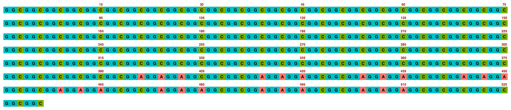
```

This is the typical single sequence visualisation produced by this package. However, almost every aspect of the visualisation is configurable via arguments to `visualise_single_sequence()` (and the resulting `ggplot` object can be further modified in standard `ggplot` manner if required).

The resolution can be changed with `pixels_per_base`, but it is recommended to not go too low otherwise text can become illegible (and going too high obviously increases filesize). The default value of 100 is often a happy medium.

For all `visualise_` functions, the `render_device` argument can be used to control the rendering method. It is fed directly to `ggsave(device = )`, so the `ggsave` documentation fully explains its use. The default `ragg::agg_png` works well and ensures consistent graphics (though not font) rendering across platforms/operating systems, so you should not need to change it.
```{r}
## Create image
visualise_single_sequence(sone_2019_f1_1_expanded_ggt_added, 
                          filename = "README_files/output/single_sequence_02.png", 
                          return = FALSE,
                          pixels_per_base = 20)

## View image
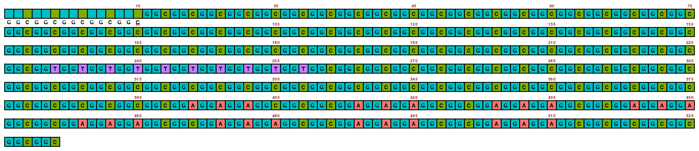
```


## Colour customisation
All of the colours used in the visualisation can be modified with the following arguments:

- `sequence_colours`: A length-4 vector of the colours used for the boxes of A, C, G, and T respectively.
- `sequence_text_colour`: The colour used for the A, C, G, and T lettering inside the boxes.
- `index_annotation_colour`: The colour used for the index numbers above/below the boxes.
- `background_colour`: The colour used for the background.
- `outline_colour`: The colour used for the box outlines.

For example, we can change all of the colours in an inadvisable way:

```{r}
## Create image
visualise_single_sequence(sone_2019_f1_1_expanded_ggt_added,
                          filename = "README_files/output/single_sequence_03.png", 
                          return = FALSE,
                          sequence_colours = c("black", "white", "#00FFFF", "#00FF00"),
                          sequence_text_colour = "magenta",
                          index_annotation_colour = "yellow",
                          background_colour = "red",
                          outline_colour = "orange")

## View image
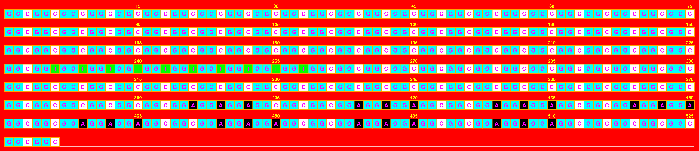
```

Included in `ggDNAvis` are a set of colour palettes for sequence colours that can often be helpful. The default is `sequence_colour_palettes$ggplot_style`, as seen in the first example above. The other palettes are `$bright_pale`, `$bright_pale2`, `$bright_deep`, and `$sanger`:

The `bright_pale` palette works well with either white or black text, depending on how much the text is desired to "pop":
```{r}
## Create image
visualise_single_sequence(sone_2019_f1_1_expanded_ggt_added,
                          filename = "README_files/output/single_sequence_04.png", 
                          return = FALSE,
                          sequence_colours = sequence_colour_palettes$bright_pale,
                          sequence_text_colour = "white")

## View image
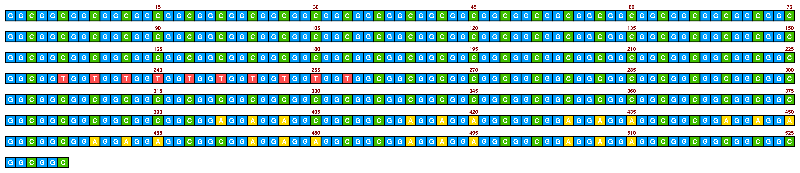
```

```{r}
## Create image
visualise_single_sequence(sone_2019_f1_1_expanded_ggt_added,
                          filename = "README_files/output/single_sequence_05.png", 
                          return = FALSE,
                          sequence_colours = sequence_colour_palettes$bright_pale,
                          sequence_text_colour = "black")

## View image

```

`bright_pale2` is the same but with a slightly lighter shade of green:

```{r}
## Create image
visualise_single_sequence(sone_2019_f1_1_expanded_ggt_added,
                          filename = "README_files/output/single_sequence_06.png", 
                          return = FALSE,
                          sequence_colours = sequence_colour_palettes$bright_pale2,
                          sequence_text_colour = "black")

## View image
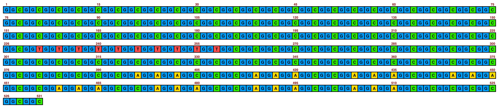
```

The `bright_deep` palette works best with white text:
```{r}
## Create image
visualise_single_sequence(sone_2019_f1_1_expanded_ggt_added,
                          filename = "README_files/output/single_sequence_07.png", 
                          return = FALSE,
                          sequence_colours = sequence_colour_palettes$bright_deep,
                          sequence_text_colour = "white")

## View image
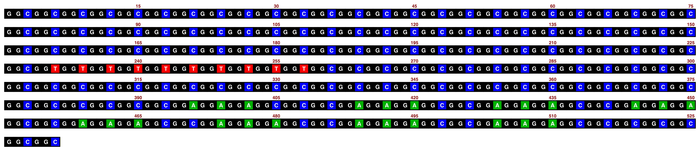
```

The `sanger` palette is inspired by old-school Sanger sequencing readouts and works best with white text:
```{r}
## Create image
visualise_single_sequence(sone_2019_f1_1_expanded_ggt_added,
                          filename = "README_files/output/single_sequence_08.png", 
                          return = FALSE,
                          sequence_colours = sequence_colour_palettes$sanger,
                          sequence_text_colour = "white",
                          outline_colour = "darkgrey")

## View image

```

## Layout customisation
Many aspects of the sequence layout are also customisable via arguments:

- `line_wrapping`: The length/number of bases in each line.
- `spacing`: The number of blank lines in between each line of sequence. Must be an integer - this is a fundamental consequence of how the images are rasterised and the whole visualisation logic would need to be re-implemented to allow non-integer spacing values.
- `margin`: The margin around the image in terms of the size of base boxes (e.g. the default value of 0.5 adds a margin half the size of the base boxes, which is 50 px with the default `pixels_per_base = 100`). Note that if index annotations are on, there is a minimum margin of 1 above (if annotations are above) of below (if annotations are below) to allow space to render the annotations, so if margin is set to less than this then it will be increased to 1 in the relevant direction. Also note that if the margin is very narrow it can clip the box outlines, as they are rendered centred on the actual edge of the boxes (i.e. they "spill over" a little to each side if outline linewidth is non-zero), so placing the margin exactly at the box edges will cut half the outlines.
- `sequence_text_size`: The size of the text inside the boxes. Can be set to 0 to disable text inside boxes. Defaults to 16.
- `index_annotation_size`: The size of the index numbers above/below the boxes. Should not be set to 0 to disable; instead disable via `index_annotation_interval = 0`. Defaults to 12.5.
- `index_annotation_interval`: The frequency at which index numbers should be listed. Can be set to 0 to disable index annotations. Defaults to 15.
- `index_annotations_above`: Boolean specifying whether index annotations should be drawn above or below each line of sequence. Defaults to `TRUE` (above).
- `index_annotation_vertical_position`: How far annotation numbers should be rendered above (if `index_annotations_above = TRUE`) or below (if `index_annotations_above = FALSE`) each base. Defaults to 1/3, not recommended to change generally. If spacing is much larger than 1, setting this to a slightly higher value might be appropriate.
- `outline_linewidth`: The thickness of the box outlines. Can be set to 0 to disable box outlines. Defaults to 3.
- `outline_join`: Changes how the corners of the box outlines are handled. Must be one of `"mitre"`, `"bevel"`, or `"round"`. Defaults to `"mitre"`. It is unlikely that you would ever need to change this.

A sensible example of how these might be changed is as follows:
```{r}
## Create image
visualise_single_sequence(sone_2019_f1_1_expanded_ggt_added,
                          filename = "README_files/output/single_sequence_09.png", 
                          return = FALSE,
                          sequence_colours = sequence_colour_palettes$ggplot_style,
                          margin = 2,
                          spacing = 2,
                          line_wrapping = 60,
                          index_annotation_interval = 20,
                          index_annotations_above = FALSE,
                          index_annotation_vertical_position = 1/2,
                          outline_linewidth = 0)

## View image
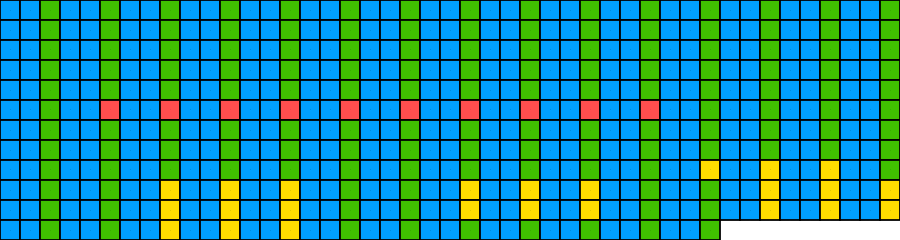
```

Setting spacing, margin, sequence text size, and index annotation interval all to 0 produces a no-frills visualisation of the sequence only. If doing so, `pixels_per_base` can be set low as there is no text that would be rendered poorly at low resolutions:
```{r}
## Create image
visualise_single_sequence(sone_2019_f1_1_expanded_ggt_added,
                          filename = "README_files/output/single_sequence_10.png", 
                          return = FALSE,
                          sequence_colours = sequence_colour_palettes$bright_pale,
                          margin = 0,
                          spacing = 0,
                          line_wrapping = 45,
                          sequence_text_size = 0,
                          index_annotation_interval = 0,
                          pixels_per_base = 20,
                          outline_linewidth = 5)

## View image

```
This produced a warning message as setting the margin to 0 clipped off the outlines of the outermost boxes. Either a slightly larger margin can be used:

```{r}
## Create image
visualise_single_sequence(sone_2019_f1_1_expanded_ggt_added,
                          filename = "README_files/output/single_sequence_11.png", 
                          return = FALSE,
                          sequence_colours = sequence_colour_palettes$bright_pale,
                          margin = 0.3,
                          spacing = 0,
                          line_wrapping = 45,
                          sequence_text_size = 0,
                          index_annotation_interval = 0,
                          pixels_per_base = 20,
                          outline_linewidth = 3)

## View image
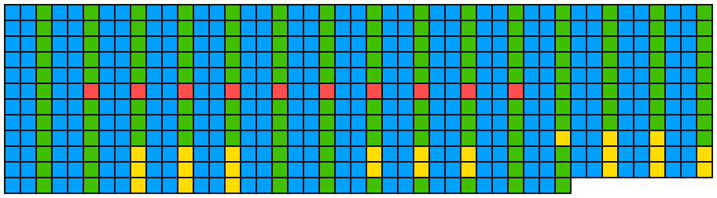
```

Or the outlines can be turned off:

```{r}
## Create image
visualise_single_sequence(sone_2019_f1_1_expanded_ggt_added,
                          filename = "README_files/output/single_sequence_12.png", 
                          return = FALSE,
                          sequence_colours = sequence_colour_palettes$bright_pale,
                          margin = 0,
                          spacing = 0,
                          line_wrapping = 45,
                          sequence_text_size = 0,
                          index_annotation_interval = 0,
                          pixels_per_base = 20,
                          outline_linewidth = 0)

## View image

```


When changing line wrapping and annotation interval, divisibility is important. It is generally recommended to make the line wrapping length a multiple of the motif length when visualising repeats (e.g. a multiple of 3 for a trinucleotide repeat), and to make the index annotation interval a factor of the line wrapping length. If the annotation interval is not a factor of the line length, then there will be uneven gaps between annotations as the interval is counted *from the start of each line*.

Here is an example where these guidelines are not followed:
```{r}
## Create image
visualise_single_sequence(sone_2019_f1_1_expanded_ggt_added,
                          filename = "README_files/output/single_sequence_13.png", 
                          return = FALSE,
                          sequence_colours = sequence_colour_palettes$bright_deep,
                          sequence_text_colour = "white",
                          line_wrapping = 65,
                          index_annotation_interval = 15)

## View image
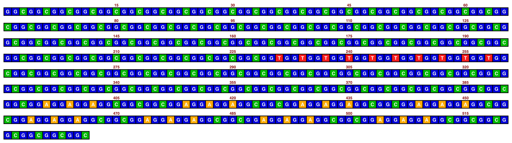
```

When setting spacing to 0, it is highly recommended to disable index annotations via `index_annotation_interval = 0`, otherwise there is nowhere for them to render:
```{r}
## Create image
visualise_single_sequence(sone_2019_f1_1_expanded_ggt_added,
                          filename = "README_files/output/single_sequence_14.png", 
                          return = FALSE,
                          sequence_colours = sequence_colour_palettes$sanger,
                          sequence_text_colour = "white",
                          index_annotation_colour = "magenta",
                          spacing = 0,
                          outline_colour = "magenta")

## View image
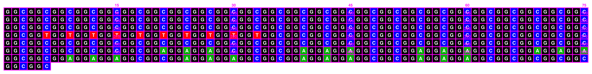
```


# Visualising many DNA/RNA sequences
## Basic visualisation
ggDNAvis can be used to visualise multiple DNA sequences via `visualise_many_sequences()`. This function takes a vector of sequences as its primary input, which do not all have to be the same length and can be blank for spacing lines. This can be constructed manually e.g. `c("GGCGGCGGC", "", "TTATTA")`, but is more easily produced by `extract_and_sort_sequences()`.

Here is an example of how that could be accomplished with the `example_many_sequences` data, with a reminder of how to load sequence/quality data from FASTQ and merge with metadata (as fully explained in the [reading standard FASTQ](#331-standard-fastq) section):

```{r}
## Reminder of how to load data from file
fastq_data <- read_fastq("inst/extdata/example_many_sequences_raw.fastq", calculate_length = TRUE)
metadata   <- read.csv("inst/extdata/example_many_sequences_metadata.csv")
merged_fastq_data <- merge_fastq_with_metadata(fastq_data, metadata)

## Subset and change colnames to make it match example_many_sequences
merged_fastq_data <- merged_fastq_data[, c("family", "individual", "read", "forward_sequence", "sequence_length", "forward_quality")]
colnames(merged_fastq_data)[c(4,6)] <- c("sequence", "quality")

## Prove equivalance to example_many_sequences
identical(merged_fastq_data, example_many_sequences[, 1:6])


## Look at first 4 rows of the data as a reminder
github_table(head(merged_fastq_data, 4))

## Extract sequences to a character vector
sequences_for_visualisation <- extract_and_sort_sequences(merged_fastq_data)

## View the character vector
sequences_for_visualisation

## Use the character vector to make the image
visualise_many_sequences(sequences_for_visualisation,
                         filename = "README_files/output/many_sequences_01.png",
                         return = FALSE)

## View image
knitr::include_graphics("README_files/output/many_sequences_01.png")
```

## Sequence arrangement customisation
The `extract_and_sort_sequences()` function is highly configurable to change the arrangement and spacing of the sequences.

It takes the following arguments:

- `sequence_dataframe`: The data to be processed
- `sequence_variable`: The name of the column we are extracting. This doesn't actually have to be a sequence, it could be any information that we want to convert into a sorted vector spaced out with empty strings.
- `grouping_levels`: How the data should be grouped. This is a named numerical vector stating which variables/columns should be used to group the data, and how many lines should be left between groups at each level. For example, the default `c("family" = 8, "individual" = 2)` means the top-level grouping is done by categories in the `"family"` column and there are 8 blank lines between each family, and the second-level gropuing is done by the `"individual"` column and there are 2 blank lines between individuals within the same family. This is implemented recursively, so any number of grouping variables can be used (or this can be set to `NA` to turn off grouping entirely).
- `sort_by`: The name of the column used to sort sequences within the lowest-level groups. This is generally the sequence length (but doesn't have to be).
- `desc_sort`: Whether the sequences should be sorted by the `sort_by` variable descending (`desc_sort = TRUE`) or (`desc_sort = FALSE`).

The image above used all the default values, which are set up to work with the columns present in `example_many_sequences` and use the families-separated-by-8, individuals-separated-by-2 grouping and arranged sequences in descending length order.

Here is the same image but with the default arguments explicitly stated:

```{r}
## Extract sequences to a character vector
## Remember that example_many_sequences is identical to the data 
## read from FASTQ and metadata CSV in the previous code section
sequences_for_visualisation <- extract_and_sort_sequences(example_many_sequences,
                                                          sequence_variable = "sequence",
                                                          grouping_levels = c("family" = 8,
                                                                              "individual" = 2),
                                                          sort_by = "sequence_length",
                                                          desc_sort = TRUE)

## We will not view the character vector in the interests of avoiding clutter.

## Use the character vector to make the image
visualise_many_sequences(sequences_for_visualisation,
                         filename = "README_files/output/many_sequences_02.png",
                         return = FALSE)

## View image
knitr::include_graphics("README_files/output/many_sequences_02.png")
```

Here the top large cluster is Family 1, containing individuals F1-1, F1-2, and F-3. These individuals contain 5, 2, and 3 reads respectively, and are separated from each other by 2 blank lines. After Family 1, there is there 8 blank lines before Family 2. Family 2 contains F2-1 and F2-2 with 1 and 3 reads (individuals separated by 2 blank lines), then there are 8 blank lines before Family 3. Family 3 contains F3-1, F3-2, F3-3, and F3-4 with 2, 3, 1, and 3 reads.

If we wanted to group only by individual without showing the family structure, and present reads in ascending length order for each individual, we could do the following:

```{r}
## Extract sequences to a character vector
sequences_for_visualisation <- extract_and_sort_sequences(example_many_sequences,
                                                          sequence_variable = "sequence",
                                                          grouping_levels = c("individual" = 1),
                                                          sort_by = "sequence_length",
                                                          desc_sort = FALSE)

## Use the character vector to make the image
visualise_many_sequences(sequences_for_visualisation,
                         filename = "README_files/output/many_sequences_03.png",
                         return = FALSE)

## View image

```

Now we have a group for each individual, with sequences in ascending length order per individual, and one blank line between individuals.

We could also turn off grouping entirely to just visualise all of the reads in length order, via `grouping_levels = NA`:

```{r}
## Extract sequences to a character vector
sequences_for_visualisation <- extract_and_sort_sequences(example_many_sequences,
                                                          sequence_variable = "sequence",
                                                          grouping_levels = NA,
                                                          sort_by = "sequence_length",
                                                          desc_sort = TRUE)

## Use the character vector to make the image
visualise_many_sequences(sequences_for_visualisation,
                         filename = "README_files/output/many_sequences_04.png",
                         return = FALSE)

## View image

```

We can also turn off sorting entirely (keeping grouping off) with `sort_by = NA` to simply show all the reads in the order in which they appear in the dataframe:

NB: if `sort_by = NA` is used, then `desc_sort` does nothing so it doesn't matter what it is set to.

```{r}
## Extract sequences to a character vector
sequences_for_visualisation <- extract_and_sort_sequences(example_many_sequences,
                                                          sequence_variable = "sequence",
                                                          grouping_levels = NA,
                                                          sort_by = NA)

## Use the character vector to make the image
visualise_many_sequences(sequences_for_visualisation,
                         filename = "README_files/output/many_sequences_05.png",
                         return = FALSE)

## View image

```

It is also possible to keep grouping on while turning sorting off if desired:

```{r}
## Extract sequences to a character vector
sequences_for_visualisation <- extract_and_sort_sequences(example_many_sequences,
                                                          sequence_variable = "sequence",
                                                          grouping_levels = c("family" = 2,
                                                                              "individual" = 1),
                                                          sort_by = NA)

## Use the character vector to make the image
visualise_many_sequences(sequences_for_visualisation,
                         filename = "README_files/output/many_sequences_06.png",
                         return = FALSE)

## View image

```

The grouping spacers can be set to 0 to sort within groups without visually separating them (but negative values don't work - they produce an error in `rep()` as the blank line can't be repeated a negative number of times). Additionally, the order of the groups/levels within a grouping variable can be changed in standard R fashion with `factor(x, levels = ...)`:

```{r}
## Reorder families
example_many_sequences_reordered <- example_many_sequences
example_many_sequences_reordered$family_reordered <- factor(example_many_sequences_reordered$family,
                                                            levels = c("Family 2", 
                                                                       "Family 3", 
                                                                       "Family 1"))

## Extract sequences to a character vector
sequences_for_visualisation <- extract_and_sort_sequences(example_many_sequences_reordered,
                                                          sequence_variable = "sequence",
                                                          grouping_levels = c("family_reordered" = 0),
                                                          sort_by = "sequence_length")

## Use the character vector to make the image
visualise_many_sequences(sequences_for_visualisation,
                         filename = "README_files/output/many_sequences_07.png",
                         return = FALSE)

## View image


```

Finally, all the same grouping and sorting logic can be used to extract any other column as a character vector, though of course if it isn't DNA sequence then the resulting vector is not valid input to `visualise_many_sequences()`. The column for extraction is specified by `sequence_variable`, and the column for sorting is `sort_by`. If the `sort_by` column is non-numeric then it will be sorted alphabetically, just like using `sort()` on a character vector.

```{r}
## Extract qualities to character vector,
## sorted alphabetically by quality string
extracted_and_sorted_qualities <- extract_and_sort_sequences(example_many_sequences,
                                                             sequence_variable = "quality",
                                                             grouping_levels = c("family" = 2),
                                                             sort_by = "quality",
                                                             desc_sort = FALSE)

## View character vector
print(extracted_and_sorted_qualities, quote = F)
```

This extracted the `quality` column, with families separated by 2 blank strings, and sorted alphabetically by quality string within each family.


## Colour and layout customisation
As with `visualise_single_sequence()`, colours in `visualise_many_sequences()` are highly customisable and can use the various palettes from `sequence_colour_palettes`. Additionally, margin, resolution, and text size are customisable (including turning text off by setting size to 0).

Colour-related arguments:

- `sequence_colours`: A length-4 vector of the colours used for the boxes of A, C, G, and T respectively.
- `sequence_text_colour`: The colour used for the A, C, G, and T lettering inside the boxes.
- `background_colour`: The colour used for the background.
- `outline_colour`: The colour used for the box outlines.

Layout-related arguments:

- `margin`: The margin around the image in terms of the size of base boxes (e.g. the default value of 0.5 adds a margin half the size of the base boxes, which is 50 px with the default `pixels_per_base = 100`).
- `sequence_text_size`: The size of the text inside the boxes. Can be set to 0 to disable text inside boxes. Defaults to 16.
- `outline_linewidth`: The thickness of the box outlines. Can be set to 0 to disable box outlines. Defaults to 3.
- `outline_join`: Changes how the corners of the box outlines are handled. Must be one of `"mitre"`, `"bevel"`, or `"round"`. Defaults to `"mitre"`. It is unlikely that you would ever need to change this.
- `pixels_per_base`: Resolution, as determined by number of pixels in the side length of one DNA base square. Everything else is scaled proportionally. Defaults to 100 (sensible for text, but can be set lower e.g. 10 or 20 if text is turned off).
- `render_device`: The device `ggsave` should use to render the plot. Defaults to `ragg::agg_png`, not recommended to change. Can be set to `NULL` to infer device based on `filename` extension.

For example, a layout with increased margins, enlarged text, and crazy colours might be:
```{r}
## Extract sequences to a character vector
sequences_for_visualisation <- extract_and_sort_sequences(example_many_sequences)

## Use the character vector to make the image
visualise_many_sequences(sequences_for_visualisation,
                         filename = "README_files/output/many_sequences_08.png",
                         return = FALSE,
                         sequence_colours = c("orange", "#00FF00", "magenta", "black"),
                         sequence_text_colour = "cyan",
                         background_colour = "yellow",
                         outline_colour = "red",
                         outline_join = "round",
                         outline_linewidth = 15,
                         sequence_text_size = 40,
                         margin = 5)

## View image
knitr::include_graphics("README_files/output/many_sequences_08.png")
```

As with `visualise_single_sequence()`, text can be turned off, in which case it is sensible to reduce the resolution:

```{r}
## Extract sequences to a character vector
sequences_for_visualisation <- extract_and_sort_sequences(example_many_sequences,
                                                          grouping_levels = c("family" = 4,
                                                                              "individual" = 1))

## Use the character vector to make the image
visualise_many_sequences(sequences_for_visualisation,
                         filename = "README_files/output/many_sequences_09.png",
                         return = FALSE,
                         sequence_colours = sequence_colour_palettes$bright_pale,
                         sequence_text_size = 0,
                         margin = 0.1,
                         pixels_per_base = 20,
                         outline_join = "round")

## View image
knitr::include_graphics("README_files/output/many_sequences_09.png")
```
Note that the margin/outline warning is produced whenever the margin is ≤0.25 and the outline linewidth is >0. Getting the warning does not necessarily mean that the outlines are getting cut off (as this only happens if the half of the outline that falls outside the boxes is thicker than the margin), but if you get the warning you should check. In this case it's fine and the outlines are not getting cut off with 0.1 margin.


# Visualising DNA methylation/modification
## Basic visualisation
When basecalling Oxford Nanopore sequencing data in Guppy or Dorado, modified basecalling can be enabled. This means the resulting BAM file contains information on DNA modifications as well as the sequence information. Most commonly, the modification assessed is 5-cytosine-methylation at CpG sites (5'-CG-3' dinucleotides).

The modification information is stored in the MM and ML tags of the BAM file. It can then be written to the header row of a FASTQ file via:

```{bash, eval = FALSE}
samtools fastq -T MM,ML ${input_bam_file} > "modified_fastq_file.fastq"
```

This is all discussed in more detail in the [reading from modified FASTQ](#332-modified-fastq-eg-methylation) section.

As a reminder, methylation information can be read from FASTQ as follows:

```{r}
modified_fastq_data <- read_modified_fastq("inst/extdata/example_many_sequences_raw_modified.fastq")
metadata            <- read.csv("inst/extdata/example_many_sequences_metadata.csv")

## Merge with offset = 1 (map C to C of palindromic CG sites when reversing)
## See the reading from modified FASTQ section for a full discussion
merged_modification_data <- merge_methylation_with_metadata(modified_fastq_data, metadata,
                                                            reversed_location_offset = 1)

## Subset and change colnames to make it match example_many_sequences
merged_modification_data <- merged_modification_data[, c("family", "individual", "read", "forward_sequence", "sequence_length", "forward_quality", "forward_C+m?_locations", "forward_C+m?_probabilities", "forward_C+h?_locations", "forward_C+h?_probabilities")]
colnames(merged_modification_data)[c(4,6:10)] <- c("sequence", "quality", "methylation_locations", "methylation_probabilities", "hydroxymethylation_locations", "hydroxymethylation_probabilities")

## Prove equivalance to example_many_sequences
identical(merged_modification_data, example_many_sequences)

## Look at first 4 rows of the data as a reminder
github_table(head(merged_modification_data, 4))
```

Once we have the dataframe with all forward modification columns, we can extract and sort them with `extract_methylation_from_dataframe()`. This function works extremely similarly to `extract_and_sort_sequences()` (as explained with examples previously in the [many sequences arrangement customisation](#52-sequence-arrangement-customisation) section), but instead of taking a single argument for the sequence column to extract, it takes three arguments for locations, probabilities, and sequence length colnames to extract:

```{r}
## Extract locations, probabilities, and lengths
## Remember that example_many_sequences is identical to merged_modification_data
methylation_data_for_visualisation <- extract_methylation_from_dataframe(
    example_many_sequences,
    locations_colname = "methylation_locations",
    probabilities_colname = "methylation_probabilities",
    lengths_colname = "sequence_length",
    grouping_levels = c("family" = 8, "individual" = 2),
    sort_by = "sequence_length",
    desc_sort = TRUE
)

methylation_data_for_visualisation
```
This returns a 3-item list, where each item in the list is a vector of either modification locations, probabilities, or sequence lengths. The modification locations are the indices (starting from 1) along each read at which modification was assessed, while the probabilities are 8-bit integers giving the probability of modification from 0 to 255. This is explained in more detail in the [introduction to `example_many_sequences`](#31-introduction-to-example_many_sequences) section.

To use hydroxymethylation instead of methylation, we can simply change the colnames we read from:

```{r}
## Extract locations, probabilities, and lengths
hydroxymethylation_data_for_visualisation <- extract_methylation_from_dataframe(
    example_many_sequences,
    locations_colname = "hydroxymethylation_locations",
    probabilities_colname = "hydroxymethylation_probabilities",
    lengths_colname = "sequence_length",
    grouping_levels = c("family" = 8, "individual" = 2),
    sort_by = "sequence_length",
    desc_sort = TRUE
)

hydroxymethylation_data_for_visualisation
```
The hydroxymethylation locations are the same as the methylation locations (as they have both been assessed at all CpG sites), but the probabilities are different. This should work for any modification type in the MM and ML tags, though it has only been tested for `C+m?` CG methylation and `C+h?` CG hydroxymethylation.

This list of locations, probabilities, and lengths can then be used as input for `visualise_methylation()`.

```{r}
## Use saved methylation data for visualisation to make image
visualise_methylation(modification_locations     = methylation_data_for_visualisation$locations,
                      modification_probabilities = methylation_data_for_visualisation$probabilities,
                      sequence_lengths           = methylation_data_for_visualisation$lengths,
                      filename = "README_files/output/modification_01.png",
                      return = FALSE)

## View image
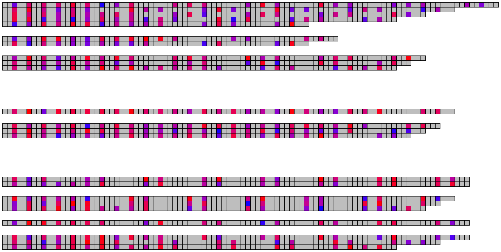
```

Here all the modification-assessed bases (Cs of CG dinucleotides) are coloured blue for low methylation probability and red for high methylation probability and linearly interpolated for intermediate probabilities. Non-modification-assessed bases are coloured grey, and the background is white.

`ggDNAvis` also contains a function for making a scalebar for the methylation probabilities: `visualise_methylation_colour_scale()`. Unlike the main `visualise_` functions, this one will work at any scale and aspect resolution, so it always returns a ggplot object that can be exported manually via `ggsave()`.

```{r}
## Create scalebar and save to object
scalebar <- visualise_methylation_colour_scale(x_axis_title = "Methylation probability")

## Write png from object
ggsave("README_files/output/modification_01_scalebar.png", scalebar, dpi = 300, width = 5, height = 1.25, device = ragg::agg_png)

## Image viewed in separate HTML after to allow partial width
```

<div align="center">
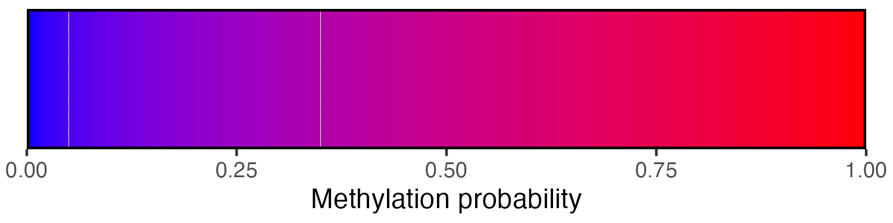
</div>


## Sequence arrangement customisation
`extract_methylation_from_dataframe()` is customisable in all the same ways as `extract_and_sort_sequences()`, as discussed in detail in the [many sequences arrangement customisation](#52-sequence-arrangement-customisation) section. This section will provide a brief reminder, but follow that link for a full explanation.

`extract_methylation_from_dataframe()` arguments:

- `modification_data`: The data to be processed
- `locations_colname`: The column locations should be extracted from.
- `probabilities_colname`: The column probabilities should be extracted from.
- `lengths_colname`: The column sequence lengths should be extracted from. All three of these just call `extract_and_sort_sequences()` to extract these columns, so they can technically be used to extract any three columns regardless of what they contain. However, if you are trying to extract and sort a non-DNA-information column, it would probably be more sensible to do that directly via `extract_and_sort_sequences()`.
- `grouping_levels`: How the data should be grouped. This is a named numerical vector stating which variables/columns should be used to group the data, and how many lines should be left between groups at each level. For example, the default `c("family" = 8, "individual" = 2)` means the top-level grouping is done by categories in the `"family"` column and there are 8 blank lines between each family, and the second-level gropuing is done by the `"individual"` column and there are 2 blank lines between individuals within the same family. This is implemented recursively, so any number of grouping variables can be used (or this can be set to `NA` to turn off grouping entirely).
- `sort_by`: The name of the column used to sort sequences within the lowest-level groups. This is generally the sequence length (but doesn't have to be).
- `desc_sort`: Whether the sequences should be sorted by the `sort_by` variable descending (`desc_sort = TRUE`) or (`desc_sort = FALSE`).

A single example of how the arrangement might be customised:

```{r}
## Extract information to list of character vectors
methylation_data_for_visualisation <- extract_methylation_from_dataframe(
    example_many_sequences,
    locations_colname = "methylation_locations",
    probabilities_colname = "methylation_probabilities",
    lengths_colname = "sequence_length",
    grouping_levels = c("individual" = 3),
    sort_by = "sequence_length",
    desc_sort = FALSE
)

## Use saved methylation data for visualisation to make image
visualise_methylation(modification_locations     = methylation_data_for_visualisation$locations,
                      modification_probabilities = methylation_data_for_visualisation$probabilities,
                      sequence_lengths           = methylation_data_for_visualisation$lengths,
                      filename = "README_files/output/modification_02.png",
                      return = FALSE)

## View image
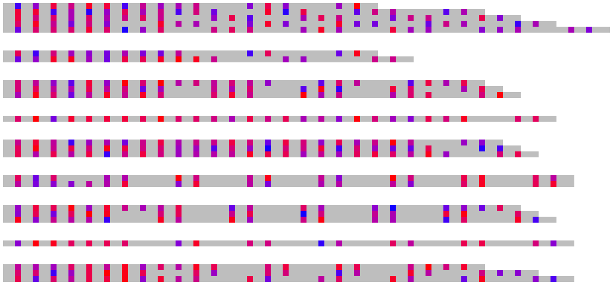
```

Here there is no grouping by family, 3 blank lines between each participant, and sequences are sorted in ascending length order within each participant.

## Colour and layout customisation

Colours in `visualise_methylation()` are controlled by setting the low and high end points of the modification colour mapping scale, as well as the colour to use for non-modification-assessed bases and the background. As before, margin and resolution are customisable. There is not currently support for having text rendered as well to avoid visual clutter, so the resolution defaults to a much lower 20 pixels per base.

One important feature to note is that the box outlines can be controlled separately for modification-assessed (e.g. C of CpG) and non-modification assessed bases. The same global `outline_colour`, `outline_linewidth`, and `outline_join` parameters are available as for the single sequence and multiple sequences functions. However, there are also `modified_bases_outline_<parameter>` and `other_bases_outline_<parameter>` arguments that can be used to override the global setting, or set to `NA` to inherit the global setting.

One use of this might be to draw outlines only for modification-assessed bases (using the default black/3/mitre settings). This could be accomplished by setting `other_bases_outline_linewidth = 0` to disable outlines for non-modification-assessed bases, while allowing modification-assessed bases to inherit the global default outlines.

Colour-related arguments:

- `low_colour`: The colour to use at the bottom end of the modification probability scale. Defaults to blue (`#0000FF`).
- `high_colour`: The colour to use at the top end of the modification probability scale. Defaults to red (`#FF0000`).
- `other_bases_colour`: The colour to use for non-modification-assessed bases. Defaults to grey and generally should be fairly neutral (though this is not enforced in any way).
- `background_colour`: The colour to use for the background. Defaults to white.
- `outline_colour`: The colour to use for the box outlines. Defaults to white.
- `modified_bases_outline_colour`: The colour to use for the box outlines of modification-assessed bases specifically. Can be set to `NA` (default), in which case the value from `outline_colour` is used. If `outline_colour` and `modified_bases_outline_colour` are set to different values, the value from `modified_bases_outline_colour` is prioritised.
- `other_bases_outline_colour`: The colour to use for the box outlines of non-modification-assessed bases specifically. Can be set to `NA` (default), in which case the value from `outline_colour` is used. If `outline_colour` and `other_bases_outline_colour` are set to different values, the value from `other_bases_outline_colour` is prioritised.

Layout-related arguments:

- `margin`: The margin around the image in terms of the size of base boxes (e.g. the default value of 0.5 adds a margin half the size of the base boxes, which is 50 px with the default `pixels_per_base = 100`).
- `outline_linewidth`: The thickness of the box outlines. Can be set to 0 to disable box outlines. Defaults to 3.
- `modified_bases_outline_linewidth`: The thickness of the box outlines for modification-assessed bases specifically. Can be set to `NA` (default) to inherit the value from `outline_linewidth`, or 0 to disable box outlines specifically for modification-assessed bases. If `outline_linewidth` and `modified_bases_outline_linewidth` are set to different values, the value from `modified_bases_outline_linewidth` is prioritised.
- `other_bases_outline_linewidth`: The thickness of the box outlines for non-modification-assessed bases specifically. Can be set to `NA` (default) to inherit the value from `outline_linewidth`, or 0 to disable box outlines specifically for non-modification-assessed bases. If `outline_linewidth` and `other_bases_outline_linewidth` are set to different values, the value from `other_bases_outline_linewidth` is prioritised.
- `outline_join`: Changes how the corners of the box outlines are handled. Must be one of `"mitre"`, `"bevel"`, or `"round"`. Defaults to `"mitre"`. It is unlikely that you would ever need to change this.
- `modified_bases_outline_join`: How corners are handled for modification-assessed bases only. Can be set to `NA` (default) to inherit from `outline_join`, otherwise overrides `outline_join`.
- `other_bases_outline_join`: How corners are handled for non-modification-assessed bases only. Can be set to `NA` (default) to inherit from `outline_join`, otherwise overrides `outline_join`.
- `pixels_per_base`: Resolution, as determined by number of pixels in the side length of one DNA base square. Everything else is scaled proportionally. Defaults to 20.
- `render_device`: The device `ggsave` should use to render the plot. Defaults to `ragg::agg_png`, not recommended to change. Can be set to `NULL` to infer device based on `filename` extension.

Here is an example with wild colours:

```{r}
## Extract information to list of character vectors
methylation_data_for_visualisation <- extract_methylation_from_dataframe(
    example_many_sequences,
    locations_colname = "methylation_locations",
    probabilities_colname = "methylation_probabilities",
    lengths_colname = "sequence_length",
    grouping_levels = c("family" = 6, 
                        "individual" = 2),
    sort_by = "sequence_length",
    desc_sort = FALSE
)

## Use saved methylation data for visualisation to make image
visualise_methylation(modification_locations     = methylation_data_for_visualisation$locations,
                      modification_probabilities = methylation_data_for_visualisation$probabilities,
                      sequence_lengths           = methylation_data_for_visualisation$lengths,
                      filename = "README_files/output/modification_03.png",
                      return = FALSE,
                      margin = 4, 
                      low_colour = "#00FF00",
                      high_colour = "blue",
                      modified_bases_outline_colour = "purple",
                      modified_bases_outline_linewidth = 5,
                      other_bases_colour = "white",
                      other_bases_outline_colour = "darkgreen",
                      other_bases_outline_linewidth = 0.5,
                      background_colour = "red")

## View image
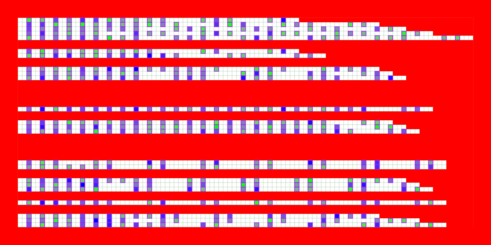

## Create scalebar and save to object
## Text colour doesn't have an argument within the function
## but can be modified by adding to the ggplot object like normal
scalebar <- visualise_methylation_colour_scale(x_axis_title = "Methylation probability",
                                               low_colour = "green",
                                               high_colour = "#0000FF",
                                               background_colour = "#FF0000",
                                               outline_colour = "darkgreen",
                                               outline_linewidth = 1) +
    theme(axis.title = element_text(colour = "white"),
          axis.text  = element_text(colour = "white"))

## Write png from object
ggsave("README_files/output/modification_03_scalebar.png", scalebar, dpi = 300, width = 5, height = 1.25, device = ragg::agg_png)

## Image viewed in separate HTML after to allow partial width
```

<div align="center">
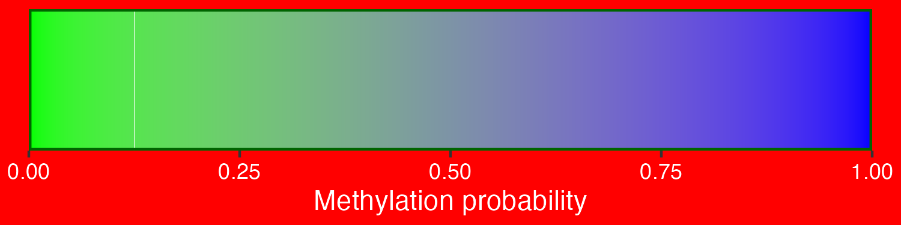
</div>


One way this might be used in practice is for making a graphic in the "lollipop" style where methylated/modified CGs are black and unmodified CGs are white:

```{r}
## Extract information to list of character vectors
methylation_data_for_visualisation <- extract_methylation_from_dataframe(
    example_many_sequences,
    locations_colname = "methylation_locations",
    probabilities_colname = "methylation_probabilities",
    lengths_colname = "sequence_length",
    grouping_levels = c("family" = 6, 
                        "individual" = 2),
    sort_by = "sequence_length",
    desc_sort = FALSE
)

## Use saved methylation data for visualisation to make image
visualise_methylation(modification_locations     = methylation_data_for_visualisation$locations,
                      modification_probabilities = methylation_data_for_visualisation$probabilities,
                      sequence_lengths           = methylation_data_for_visualisation$lengths,
                      filename = "README_files/output/modification_04.png",
                      return = FALSE,
                      margin = 0.1, 
                      low_colour = "white",
                      high_colour = "black",
                      other_bases_colour = "lightblue1",
                      other_bases_outline_colour = "grey",
                      other_bases_outline_linewidth = 1,
                      background_colour = "white")

## View image
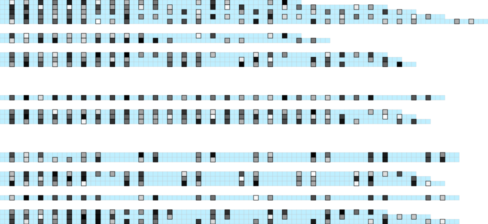

## Create scalebar and save to object
scalebar <- visualise_methylation_colour_scale(x_axis_title = "Methylation probability",
                                               low_colour = "white",
                                               high_colour = "black",
                                               background_colour = "lightblue1")

## Write png from object
ggsave("README_files/output/modification_04_scalebar.png", scalebar, dpi = 300, width = 5, height = 1.25, device = ragg::agg_png)

## Image viewed in separate HTML after to allow partial width
```

<div align="center">

</div>

## Colour mapping customisation
A very useful feature in `visualise_methylation()` is the ability to "clamp" the scale. This means all probabilities below the `low_clamp` value will be set to the low colour, all probabilities above the `high_clamp` value will be set to the high colour, and linear colour interpolation will occur only in between the clamp values.

Clamping arguments:

- `low_clamp`: The probability score at and below which all values will be represented as `low_colour`.
- `high_clamp`: The probability score at and above which all values will be represented as `high_colour`.

The clamp values need to be on the same scale as the probability input i.e. 0-255 for standard MM/ML tags from Dorado/Guppy modified basecalling. It would be possible to input decimal probabilities e.g. `"0.1,0.5,0.9,0.23"`, in which case the default high clamp of 255 will not be appropriate and must be set to a sensible value ≤ 1.

Here is the lollipop scale but with `low_clamp = 127` and `high_clamp = 128` to make all values binary white/black depending on whether they are below or above the equivalent of 0.5 methylation probability:

```{r}
## Extract information to list of character vectors
methylation_data_for_visualisation <- extract_methylation_from_dataframe(
    example_many_sequences,
    locations_colname = "methylation_locations",
    probabilities_colname = "methylation_probabilities",
    lengths_colname = "sequence_length",
    grouping_levels = c("family" = 6, 
                        "individual" = 2),
    sort_by = "sequence_length",
    desc_sort = FALSE
)

## Use saved methylation data for visualisation to make image
visualise_methylation(modification_locations     = methylation_data_for_visualisation$locations,
                      modification_probabilities = methylation_data_for_visualisation$probabilities,
                      sequence_lengths           = methylation_data_for_visualisation$lengths,
                      filename = "README_files/output/modification_05.png",
                      return = FALSE,
                      margin = 0.1, 
                      low_colour = "white",
                      low_clamp = 127,
                      high_colour = "black",
                      high_clamp = 128,
                      other_bases_colour = "lightblue1",
                      other_bases_outline_colour = "grey",
                      other_bases_outline_linewidth = 1,
                      background_colour = "white")

## View image
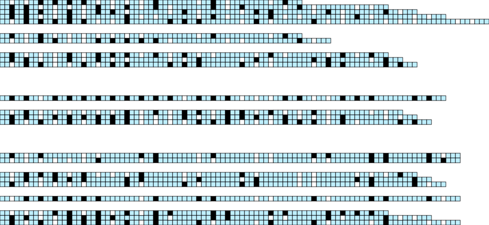

## Create scalebar and save to object
scalebar <- visualise_methylation_colour_scale(x_axis_title = "Methylation probability",
                                               low_colour = "white",
                                               low_clamp = 127,
                                               high_colour = "black",
                                               high_clamp = 128,
                                               background_colour = "lightblue1")

## Write png from object
ggsave("README_files/output/modification_05_scalebar.png", scalebar, dpi = 300, width = 5, height = 1.25, device = ragg::agg_png)
```

<div align="center">
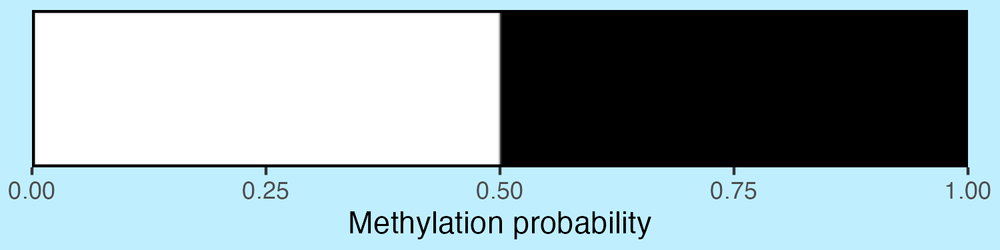
</div>

The clamping arguments do not have to be integers. Clamping is implemented with `pmin()` and `pmax()` and relies on their default behaviour for `pm<in/ax>(vector, clamping_value)`, which is to clamp to a fraction when the clamping value is fractional. For example, `pmin(c(1,2,3,4,5), 3.5)` produces `c(1.0, 2.0, 3.0, 3.5, 3.5)` i.e. the values above `3.5` were clamped down to `3.5`. Therefore, clamping with fractional values will clamp extreme probabilities to said fractional value, but this is not visible and does not interfere with plotting logic.

This means one approach is to define clamping values as `proportion*255`, as that can be easier than working out which integer to use. Using the standard blue/red colour scheme with the hydroxymethylation data but clamping at 30% and 70% probability gives the following:

```{r}
## Extract information to list of character vectors
methylation_data_for_visualisation <- extract_methylation_from_dataframe(
    example_many_sequences,
    locations_colname = "methylation_locations",
    probabilities_colname = "methylation_probabilities",
    lengths_colname = "sequence_length",
    grouping_levels = c("family" = 6, 
                        "individual" = 2),
    sort_by = "sequence_length",
    desc_sort = FALSE
)

## Use saved methylation data for visualisation to make image
visualise_methylation(modification_locations     = methylation_data_for_visualisation$locations,
                      modification_probabilities = methylation_data_for_visualisation$probabilities,
                      sequence_lengths           = methylation_data_for_visualisation$lengths,
                      filename = "README_files/output/modification_06.png",
                      return = FALSE,
                      low_clamp = 0.3*255,
                      high_clamp = 0.7*255,
                      outline_linewidth = 0)

## View image
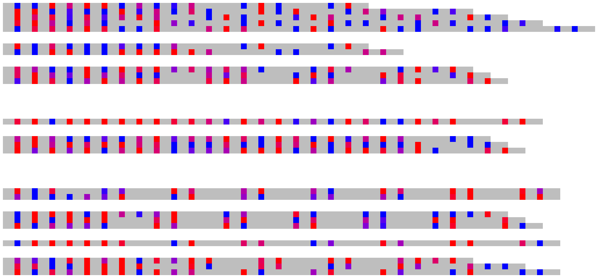

## Create scalebar and save to object
scalebar <- visualise_methylation_colour_scale(x_axis_title = "Methylation probability",
                                               low_clamp = 0.3*255,
                                               high_clamp = 0.7*255)

## Write png from object
ggsave("README_files/output/modification_06_scalebar.png", scalebar, dpi = 300, width = 5, height = 1.25, device = ragg::agg_png)
```

<div align="center">
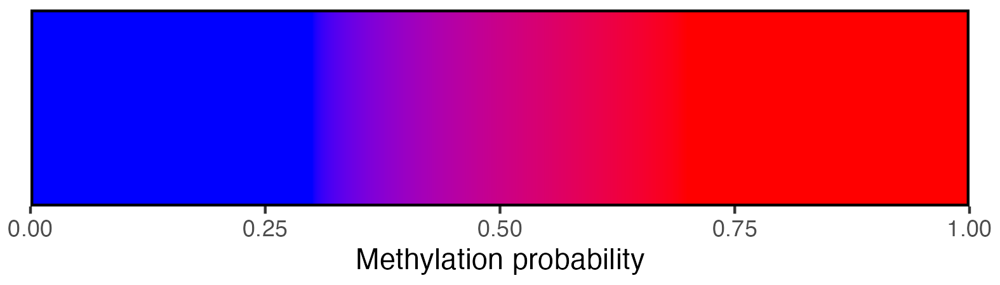
</div>

The clamping does not need to be symmetrical. One use for this is if the data is skewed. For example, the methylation scores were randomly generated from `0` to `255` for each CpG in `example_many_sequences`, but the hydroxymethylation scores were generated from `0` to `(255 - methylation score)` for each CpG to avoid >100% total modification probability, so they tend to be lower. Here is the hydroxymethylation data visualised with clamping at 10% and 50%:

```{r}
## Extract information to list of character vectors
hydroxymethylation_data_for_visualisation <- extract_methylation_from_dataframe(
    example_many_sequences,
    locations_colname = "hydroxymethylation_locations",
    probabilities_colname = "hydroxymethylation_probabilities",
    lengths_colname = "sequence_length",
    grouping_levels = c("family" = 6, 
                        "individual" = 2),
    sort_by = "sequence_length",
    desc_sort = FALSE
)

## Use saved methylation data for visualisation to make image
visualise_methylation(modification_locations     = hydroxymethylation_data_for_visualisation$locations,
                      modification_probabilities = hydroxymethylation_data_for_visualisation$probabilities,
                      sequence_lengths           = hydroxymethylation_data_for_visualisation$lengths,
                      filename = "README_files/output/modification_07.png",
                      return = FALSE,
                      low_clamp = 0.1*255,
                      high_clamp = 0.5*255,
                      other_bases_outline_linewidth = 0)

## View image
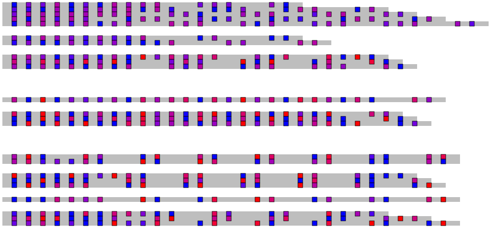

## Create scalebar and save to object
scalebar <- visualise_methylation_colour_scale(x_axis_title = "Hydroxymethylation probability",
                                               low_clamp = 0.1*255,
                                               high_clamp = 0.5*255)

## Write png from object
ggsave("README_files/output/modification_07_scalebar.png", scalebar, dpi = 300, width = 5, height = 1.25, device = ragg::agg_png)
```

<div align="center">
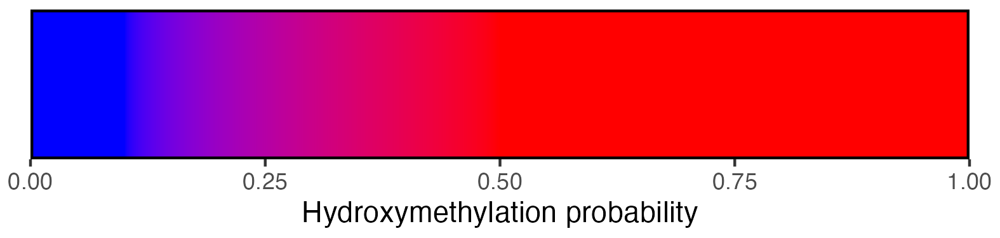
</div>

***IMPORTANT:** make sure that you provide the scalebar when presenting data, especially if clamping is used, otherwise the colours could be misleading or academically dishonest.*

## Scalebar customisation
The scalebar produced by `visualise_methylation_colour_scale()` is, like the rest of the visualisations, highly customisable. The colours, clamping, precision, and presence of various plot elements are all customisable via the following arguments:

Colour arguments:

- `low_colour`: The colour to use at the bottom end of the modification probability scale. Defaults to blue (`#0000FF`).
- `high_colour`: The colour to use at the top end of the modification probability scale. Defaults to red (`#FF0000`).
- `background_colour`: The colour to use for the background. Defaults to white.
- `outline_colour`: The colour of the outline around the whole scalebar. Defaults to black.

Clamping arguments:

- `low_clamp`: The probability score at and below which all values will be represented as `low_colour`. Defaults to `0`.
- `high_clamp`: The probability score at and above which all values will be represented as `high_colour`. Defaults to `255`.
- `full_range`: Length-2 numeric vector specifying the range of possible probability values. Defaults to `c(0, 255)` but `c(0, 1)` would also be sensible depending on the data.
- `precision`: How many different shades should be rendered. Larger values give a smoother gradient. Defaults to `10^3` i.e. `1000`, which looks smooth to my eyes and isn't too intensive to calculate.

Layout arguments:

- `x_axis_title`: The desired x-axis title. Defaults to `NULL` (no title).
- `do_x_ticks`: Boolean specifying whether ticks on the x axis should be enabled. Defaults to `TRUE`.
- `do_side_scale`: Boolean specifying whether a smaller scalebar should be rendered on the right. Defaults to FALSE. I think it is unlikely anyone would want to use this, but the option is here. One potential usecase is that this side scalebar shows the raw probability values (e.g. 0 to 255), whereas the x-axis is normalised to 0-1.
- `side_scale_title`: The desired title for the right-hand scalebar, if turned on. Defaults to `NULL`.
- `outline_linewidth`: The width of the outline around the whole scalebar. Can be set to 0 to remove outline. Defaults to 1.


Using all defaults but with lower precision gives the following:

```{r}
## Create scalebar and save to object
scalebar <- visualise_methylation_colour_scale(precision = 10)

## Write png from object
ggsave("README_files/output/modification_scalebar_alone_01.png", scalebar, dpi = 300, width = 5, height = 1.25, device = ragg::agg_png)

## Image viewed in separate HTML after to allow partial width
```

<div align="center">
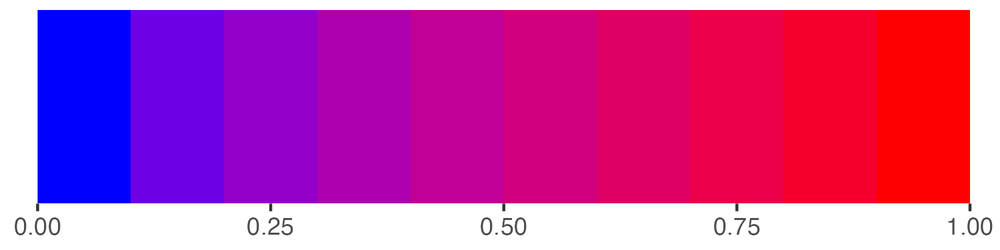
</div>

Disabling x axis ticks with intermediate precision gives the following:

```{r}
## Create scalebar and save to object
scalebar <- visualise_methylation_colour_scale(precision = 50,
                                               do_x_ticks = FALSE)

## Write png from object
ggsave("README_files/output/modification_scalebar_alone_02.png", scalebar, dpi = 300, width = 5, height = 1.25, device = ragg::agg_png)
```

<div align="center">

</div>

If ticks are left on, they can be customised with `scale_x_continuous()` as per usual for a ggplot. Here is an example with the side scalebar turned on and ticks customised:

```{r}
## Create scalebar and save to object
scalebar <- visualise_methylation_colour_scale(high_colour = "green",
                                               low_colour = "yellow",
                                               high_clamp = 0.8,
                                               low_clamp = 0.5, 
                                               full_range = c(0,1),
                                               precision = 100,
                                               do_x_ticks = TRUE,
                                               x_axis_title = "some kind of title",
                                               do_side_scale = TRUE,
                                               side_scale_title = "some other title",
                                               outline_colour = "red",
                                               outline_linewidth = 3) +
    scale_x_continuous(breaks = seq(0, 1, 0.1))

## Write png from object
ggsave("README_files/output/modification_scalebar_alone_03.png", scalebar, dpi = 300, width = 5, height = 2, device = ragg::agg_png)
```

<div align="center">
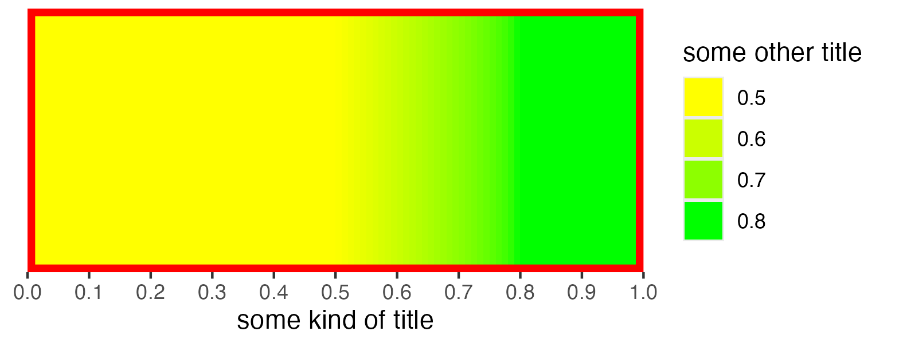
</div>

And here is an example of a more sensible scalebar but with the side scale turned on:

```{r}
## Create scalebar and save to object
scalebar <- visualise_methylation_colour_scale(low_clamp = 0.1*255,
                                               high_clamp  = 0.9*255,
                                               x_axis_title = "Methylation probability",
                                               do_side_scale = TRUE,
                                               side_scale_title = "Raw\nprobability\nscore",
                                               outline_linewidth = 0)

## Write png from object
ggsave("README_files/output/modification_scalebar_alone_04.png", scalebar, dpi = 300, width = 5, height = 2, device = ragg::agg_png)
```

<div align="center">
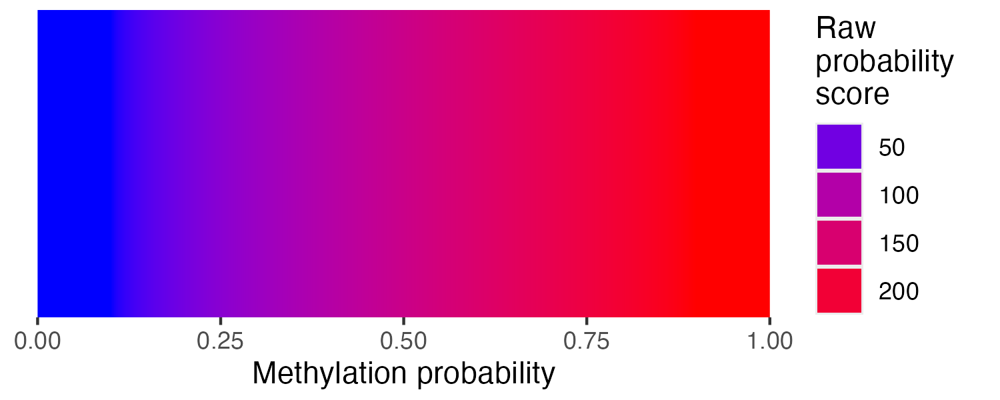
</div>

## Think about the offset!
When merging modification data read from FASTQ, the positional offset when reversing can be changed (as discussed in detail in the [reading from modified FASTQ](#332-modified-fastq-eg-methylation) section).

A summary of the sensible offset options (i.e. 0 or 1) copied from that section is as follows:

```{r, echo = FALSE}
{
cat("Here the stars represent the true biochemical modifications on the reverse strand:
(occurring at the Cs of CGs in the 5'-3' direction)\n\n\n")
cat("5'  GGCGGCGGCGGCGGCGGA  3'\n")
cat("3'  CCGCCGCCGCCGCCGCCT  5'\n")
cat("       *  *  *  *  *      \n")
}
```

```{r, echo = FALSE}
{
cat("If we take the complementary locations on the forward strand,
the modification locations correspond to Gs rather than Cs,
but are in the exact same locations:\n\n")
cat("       o  o  o  o  o      \n")
cat("5'  GGCGGCGGCGGCGGCGGA  3'\n")
cat("3'  CCGCCGCCGCCGCCGCCT  5'\n")
cat("       *  *  *  *  *      \n")
}
```

```{r, echo = FALSE}
{
cat("If we offset the locations by 1 on the forward strand,
the modifications are always associated with the C of a CG,
but the locations are moved slightly:\n\n")
cat("      o  o  o  o  o       \n")
cat("5'  GGCGGCGGCGGCGGCGGA  3'\n")
cat("3'  CCGCCGCCGCCGCCGCCT  5'\n")
cat("       *  *  *  *  *      \n")
}
```

The visualisations thus far in this section have all used `offset = 1` so that methylated Cs in CGs on the reverse strand are mapped to Cs of CGs in the forward strand when reverse complemented, ensuring consistency with reads that were forward to begin with. If we used `offset = 0` to show the true biochemical locations of the modifications, we would get the following:

```{r}
modified_fastq_data <- read_modified_fastq("inst/extdata/example_many_sequences_raw_modified.fastq")
metadata            <- read.csv("inst/extdata/example_many_sequences_metadata.csv")

## Merge with offset = 0 (map C to G of palindromic CG sites when reversing)
## See the reading from modified FASTQ section for a full discussion
merged_modification_data <- merge_methylation_with_metadata(modified_fastq_data, metadata,
                                                            reversed_location_offset = 0)

## Extract information to list of character vectors
## Note that this time we read from merged_modification_data,
## rather than example_many_sequences
methylation_data_for_visualisation <- extract_methylation_from_dataframe(
    merged_modification_data,
    locations_colname = "forward_C+m?_locations",
    probabilities_colname = "forward_C+m?_probabilities",
    lengths_colname = "sequence_length",
    grouping_levels = c("family" = 6, 
                        "individual" = 2),
    sort_by = "sequence_length",
    desc_sort = FALSE
)

## Use saved methylation data for visualisation to make image
visualise_methylation(modification_locations     = methylation_data_for_visualisation$locations,
                      modification_probabilities = methylation_data_for_visualisation$probabilities,
                      sequence_lengths           = methylation_data_for_visualisation$lengths,
                      filename = "README_files/output/modification_08.png",
                      return = FALSE)

## View image

```
We can see here that some methylation-assessed sites are now offset by 1, as the location is now assigned to the G of each CG site rather than the C. This is perhaps more biochemically accurate, as these Gs are complementary to the Cs on the reverse strands where the modification actually occurred.

Other offset values are theoretically possible, e.g. -2 here:
```{r}
modified_fastq_data <- read_modified_fastq("inst/extdata/example_many_sequences_raw_modified.fastq")
metadata            <- read.csv("inst/extdata/example_many_sequences_metadata.csv")

## Merge with offset = -1 (not recommended)
merged_modification_data <- merge_methylation_with_metadata(modified_fastq_data, metadata,
                                                            reversed_location_offset = -1)

## Extract information to list of character vectors
methylation_data_for_visualisation <- extract_methylation_from_dataframe(
    merged_modification_data,
    locations_colname = "forward_C+m?_locations",
    probabilities_colname = "forward_C+m?_probabilities",
    lengths_colname = "sequence_length",
    grouping_levels = c("family" = 6, 
                        "individual" = 2),
    sort_by = "sequence_length",
    desc_sort = FALSE
)

## Use saved methylation data for visualisation to make image
visualise_methylation(modification_locations     = methylation_data_for_visualisation$locations,
                      modification_probabilities = methylation_data_for_visualisation$probabilities,
                      sequence_lengths           = methylation_data_for_visualisation$lengths,
                      filename = "README_files/output/modification_09.png",
                      return = FALSE)

## View image

```
However, this is strongly discouraged and produces a warning. Offset values other than 0 and 1 have not been tested so results may be unpredictable and aspects of the visualisation may break.

Finally, it is of course possible to read from the columns that weren't reversed/forward-ified. However, ***this is likely to be misleading*** as it implies positional equivalence between bases at opposite ends of the region but on opposite strands. This is not recommended either, but there is no way to identify that you are doing this so no warning is produced.

```{r}
modified_fastq_data <- read_modified_fastq("inst/extdata/example_many_sequences_raw_modified.fastq")
metadata            <- read.csv("inst/extdata/example_many_sequences_metadata.csv")

## Merge with offset = 0 (but we aren't using the forward-ified information anyway)
merged_modification_data <- merge_methylation_with_metadata(modified_fastq_data, metadata,
                                                            reversed_location_offset = 0)

## Extract information to list of character vectors
methylation_data_for_visualisation <- extract_methylation_from_dataframe(
    merged_modification_data,
    locations_colname = "C+m?_locations",
    probabilities_colname = "C+m?_probabilities",
    lengths_colname = "sequence_length",
    grouping_levels = c("family" = 6, 
                        "individual" = 2),
    sort_by = "sequence_length",
    desc_sort = FALSE
)

## Use saved methylation data for visualisation to make image
visualise_methylation(modification_locations     = methylation_data_for_visualisation$locations,
                      modification_probabilities = methylation_data_for_visualisation$probabilities,
                      sequence_lengths           = methylation_data_for_visualisation$lengths,
                      filename = "README_files/output/modification_10.png",
                      return = FALSE)

## View image
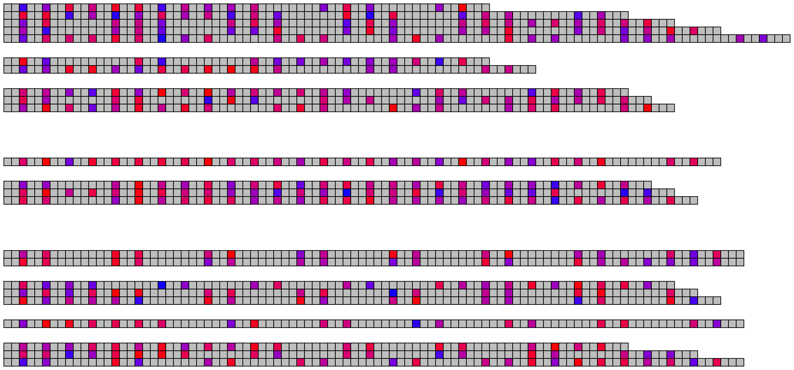
```


# References
